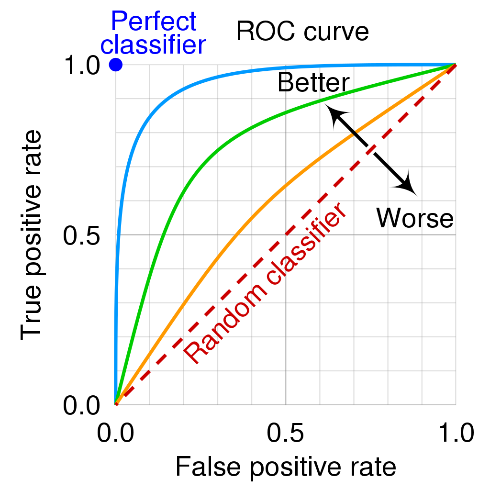

# Week 14 Machine Learning

## General Machine Learning Concept
- Simplified: in machine learning, a computer is trained to classify new data. Think of it as an input-output device that takes in a number of inputs, and based on the pattern of these inputs, determine the most likely class associated with that data. There two main types of learning strategies. 1) Supervised learning where you train the machine using data for which the correct class is known. 2) Unsupervised learning where the classifier itself tries to find patterns within the input data itself. (Biosignal and Medical Image Processing John Semmlow) 
- Classification (determine `label`) vs Regression (predict a `numerical value`) 

## General Outline of Machine Learning

1. Loading Data
  - Load toy data included in sklearn
  - Download published/annotated data from online
  - Generate data with specific statistics to learn how algorithms work
2. Preprocessing Data
  - Make data zero mean
  - Make data unit variance
  - Fix range of values
  - Deal with missing values
  - Map text labels to integer labels (if applicable) -- ML algorithms require the data be numeric
3. Dimensionality Reduction of data
  - If you use too many features and do not have enough samples, you could over fit.
  - So you have to choose the most discriminating few features
4. Applying algorithms
  - Labeled Data - Supervised 
  - Non-labeled Data - Unsupervised 
5. Evaluation 
  - Receiver Operator Curve
    - Sensitivity
    - Specificity
  - Imbalanced Data
    - Example: 95 % one class, 5% another class

- REF: Scikit-learn Essentials: Mastering the scikit-learn Machine Learning Library for Python by Dhiraj Kumar

## Various Python Libraries: When to use what
  - ref:https://www.quora.com/What-is-the-relationship-among-NumPy-SciPy-Pandas-and-Scikit-learn-and-when-should-I-use-each-one-of-them
  - Numpy -- provides efficient array computation via vectorization and broadcasting
      - Vectorization -- no need for explicit looping -- example, vector multiplication or squaring
      - Broadcasting -- manipulate multiple values at once
  - Pandas - Uses Numpy arrays as the underlying structure. Good for analyzing tabular data
  - Scipy (scientific python)- provides libraries for scientific computing, including: integration, interpolation, signal processing, linear algebra, statistics. Also uses Numpy infrastructure
  - Scikit-learn - provides a collection of machine-learning algorithms that use Numy and Scipy 
    - Most used Python library for machine-learning
      - regression
      - classification
      - clustering

## Topics Covered
  - Introduction to Scikit-learn
  - Loading Dataset using Scikit-learn
  - Preprocessing data using scikit-learn
  - Train Test split using scikit-learn
  - Linear regression using scikit-learn
  - Naive Bays using Scikit learn
  - SVM using Scikit learn
  - k-Nearest neighbor using Scikit-learn

## Introduction to Scikit-learn 
  - Choose the right estimator -- the right algorithm for doing ML
    - https://scikit-learn.org/stable/tutorial/machine_learning_map/index.html
  - Consistent -- all object share a common interface
  - Inspection -- all parameter values are exposed as public attributes
  - Limited object Hierarchy -- algorithms are represented as Python classes, datasets mainly as numpy array and parameters as standard python strings 
  - Composition -- ML as a sequences of fundamental algorithms
  - Defaults -- provides good default values

### High Level Steps
  - Choose the class of model to be coded
  - Choose the hyper parameters of the model
  - Arrange data into target and features
  - Write model fitment code using fit() method. 

### General Steps
  - Load Data
    - Three ways load data
      - Dataset loaders (toy datasets that come with skikit-learn)
        - Good for illustrating how the various algorithms work
      - Dataset fetchers (real world datasets)
        - Built-in functions to load large datasets
        - Pull from openml.org
      - Dataset generation functions
        - Artificial datasets -- can create labeled datasets
        - 
  - Pre-process Data
    - Remove mean **
    - Scale Variance **
    - Non-linear transformation
    - Normalization
    - Encoding categorical features
    - Discretization
    - Imputation of missing values 
    - Maybe remove outliers if it can be justified. Always document this in research paper

### Loading data

### Preprocessing
#### Mean and Variance
- algorithms require that all the features have variance of similar magnitude. If the magnitude differ by orders of magnitude larger than others, it might dominate the objective function.
  - Whatever mean or std you subtract from the training set, you have to use the same on the testing set. 
- Algorithms assume that the input data is Gaussian distribution with zero mean and unit variance. 
- Power transformers aim to map data from any distribution to as close to a Gaussian distribution 

#### Encoding
- Map text values to integer codes. Instead of using text for city names, use integers. Or Male = 0, Female = 1. 

#### Discretization 
- Turn continuous values in to discrete values. You bin the continuous into bins. *** Linear models can become non-linear due to discretization 

#### Imputation 
- Many real world datasets contain missing values; 
  - Discard entire rows
  - Or fill data -- usually by guessing from available data

### Splitting Data
- It is common to split data into training and testing samples. 
- Usually you do 90/10 or 80/20. 
- The splitting has to be random
- K-Cross-fold validation -- split data K times

### Linear Regression
- LR models the relationship between a dependent variable and one or more independent variable. When one increase or decrease, the other increases or decreases. 

### Naive Bayes
- Simple supervised machine learning classifier
- Assumes the features are independent 
  - Example -- apple is red, round and 4 cm in diameter 

### Support Vector Machine (SVM)
- Another supervised machine learning classifier
  - use for both classification and regression 
- Can do non-linear classification
- Hyper plane -- maximize the margin between two classes
- Support Vectors -- data points that define the hyper plane 
- Margin width -- define an optimal hyper plane we need to maximize the width
of the margin 

### Evaluation 

